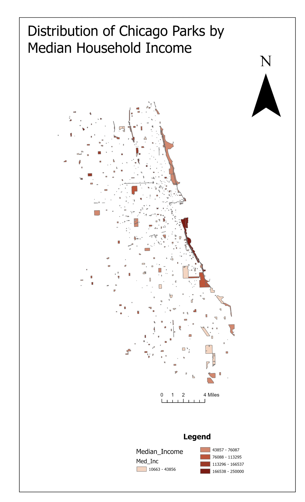

# Chicago Park Accessibility Analysis
**Integrating Municipal and Crowdsourced Data for Urban Green Space Equity**  
Author: Image Bhattarai | SDSU | GEOG-573 | 2025

---

## Project Summary
This project builds a unified park feature layer for Chicago by conflating official City of Chicago park data with OpenStreetMap (OSM) crowdsourced polygons, then joins U.S. Census median household income data to evaluate spatial equity in park distribution across the city's 77 community areas.

**Key Finding:** Parks in the highest-income lakefront corridors ($166K–$250K median household income) account for a disproportionate share of Chicago's total green space area, while low-income inland neighborhoods are served primarily by small, fragmented park parcels.

---

## Output Map

---

## Technical Workflow

### 1. CRS Harmonization
- Reprojected OSM data from GCS WGS 1984 to NAD 1983 StatePlane Illinois East
- Ensured geometric accuracy across both source datasets before integration

### 2. Multi-Source Data Conflation
- Merged City of Chicago municipal park shapefile with OSM park polygons
- Resolved 12-digit Census GEOID mismatches using custom **Arcade expressions**
- Applied `CLOSEST` spatial join operator to handle geometric nulls between datasets

### 3. Geodatabase Design
- Structured unified output as a feature class within a file geodatabase
- Maintained domain integrity and field schema consistency across merged sources

### 4. Topology Validation
- Applied **Must Not Overlap** topology rules to detect and correct spatial errors
- Validated final output for use in downstream spatial analysis

### 5. Socioeconomic Analysis
- Joined U.S. Census median household income (ACS 5-year estimates) to park polygons
- Classified parks into 4 income brackets for choropleth visualization

---

## Data Sources
| Dataset | Source | Format |
|---------|--------|--------|
| Chicago Park District | City of Chicago Open Data Portal | Shapefile |
| OpenStreetMap Parks | OSM via Overpass API | Shapefile |
| Median Household Income | U.S. Census ACS 5-Year Estimates | CSV |

---

## Tools Used
ArcGIS Pro · Arcade Expressions · Geodatabase Management · Topology Rules · Spatial Join · CRS Reprojection

---

## Key Takeaways
- OSM captured parks not present in the official municipal dataset
- Topology validation corrected overlapping features before analysis
- Income-based spatial analysis reveals clear geographic inequity in park distribution across Chicago neighborhoods
